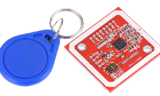
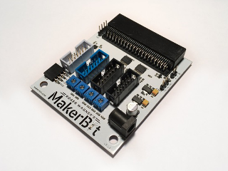
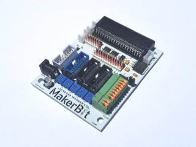

# MakerBit RFID

[](https://travis-ci.com/1010Technologies/pxt-makerbit-rfid)



MakeCode extension for the PN532 NFC RFID module.
中文化：蔡佳倫
## MakerBit Board

The MakerBit connects to the BBC micro:bit to provide easy connections to a wide variety of sensors, actuators and other components.

http://makerbit.com/

|  |  |
| :----------------------------------------------------------------------------------------------: | :----------------------------------------------------------------------------------------------------: |
|                                            _MakerBit_                                            |                                   _MakerBit+R with motor controller_                                   |

## RFID

This extension supports reading and writing data from RFID cards and tags using a PN532 NFC board.

### Example

```blocks
makerbit.onRFIDPresented(function () {
  basic.showString(makerbit.convertNumberToHex(makerbit.rfidGetUID(), HexDigits.d0))
  makerbit.rfidWriteString("Hello!")
  basic.showString(makerbit.rfidReadString())
})
```

### MakerBit onRFIDPresented

Create an event handler for an RFID tag. If an RFID tag is detected then the code within the event handler is executed. During execution, a `busy` flag is used to prevent simultaneous calls to the handler. The `busy` flag is cleared when the event handler is exited.

```sig
makerbit.onRFIDPresented(() => {
})
```

### MakerBit rfidGetUID

Retrieves the UID of an RFID tag. Returned as a hex string, or empty string if no tag is present.

```sig
makerbit.rfidGetUID()
```

### MakerBit rfidWriteString

Initializes the RFID tag in the MIFARE Classic format and writes the string data to the card as a MIFARE "well-known-type" `text` record. The maximum string length is 36 characters.

```sig
makerbit.rfidWriteString("Hello")
```

### MakerBit rfidReadString

Reads the string data stored within the card. The data is assumed to be stored as a MIFARE "well-known-type" record of type `text` or `URI`.

```sig
makerbit.rfidReadString()
```

### MakerBit rfidWriteURL

Initializes the RFID tag in the MIFARE Classic format and writes the data to the card as a MIFARE "well-known-type" `URI` record. The maximum length is 38 characters. Do not include the `http://` prefix.

```sig
makerbit.rfidWriteURL("1010technologies.com")
```

### MakerBit convertNumberToHex

Convert an integer number to a hexadecimal string, with an optional number of digits. Negative numbers are treated as 32-bit integers. Set the number of digits to 0 for the default (default is the smallest even number of digits needed to convert the number).

```sig
makerbit.convertNumberToHex(12345, 0)
```

## License

Licensed under the MIT License (MIT). See LICENSE file for more details.

## Supported targets

- for PXT/microbit
- for PXT/calliope
